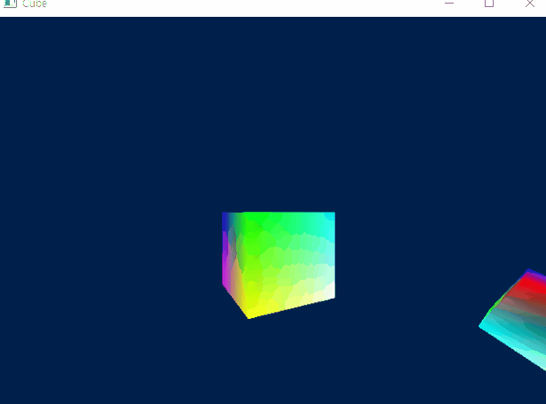

# Triangle

simple example. it describes how to init and use D3D11 Device & shader.

this example needs fx/Triangle.fx HLSL file to run.

# Cube

rotate colorful cube example. it describes how to use index buffer & constant buffer, matrix operations.

this example needs fx/Cube.fx HLSL file to run.

# Revolve Cube

this example describes how to use depth stencil buffer and various transformations.

this example needs fx/RevolveCube.fx HLSL file to run.

# Lighting

  

this example describes how to apply simle lighting.

this example needs fx/Lighting.fx HLSL file to run.

# Texture

this example describes how to use dds texture file & multiple constant buffer.

this example needs fx/Texture.fx HLSL file & texture/test.dds texture file to run.